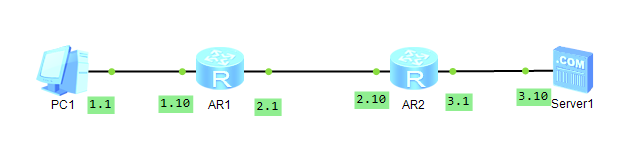

## Topology

*PC1* through multiple routers to access the *Server1*.



## Step

config IP for each equipment.

```bash
# for config the routers
system-view
interface g0/0/0
ip address 192.168.3.1 255.255.255.0
```

set up the gateway for *PC1* and *Server1*

config the static-routing-table for *AR1* and *AR2*

```bash
system-view
ip route-static 192.168.3.0 255.255.255.0 192.168.2.10
# It means that if we want to go 192.168.3.0 255.255.255.0, we go the 192.168.2.10.

# we can check it by
display ip routing-table 192.168.3.10
```

## Note

without the final step (i.e. config the static-routing-table) we cannot access the *Server 1*, b/c we *AR1* do not know how to access the *Server1* and *AR2* does not know how to access the *PC1*.