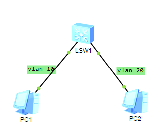

## Topology



## Port Link Types

| Type   |                                                              |                  |
| ------ | ------------------------------------------------------------ | ---------------- |
| Access | endpoint                                                     | PC, printer, etc |
| Trunk  | router                                                       | router           |
| hybrid | see [Reference](https://support.huawei.com/enterprise/en/doc/EDOC1100064352/5661a2d6/port-link-type) |                  |

## Steps

```bash
# create vlan 10
sy
vlan 10
# change type to access
int g0/0/1
port link-type access
# add to vlan 10
port default vlan 10
```

## Reflection

VLAN can isolate local network to malware distribute over whole network.

## Result

```bash
<Huawei> sy
Enter system view, return user view with Ctrl+Z.
# create vlan 10
[Huawei]vlan 10
[Huawei-vlan10]q
Apr 30 2023 03:04:20-08:00 Huawei DS/4/DATASYNC_CFGCHANGE:OID 1.3.6.1.4.1.2011.5
.25.191.3.1 configurations have been changed. The current change number is 4, th
e change loop count is 0, and the maximum number of records is 4095.
# create vlan 20
[Huawei]vlan 20
Apr 30 2023 03:04:40-08:00 Huawei DS/4/DATASYNC_CFGCHANGE:OID 1.3.6.1.4.1.2011.5
.25.191.3.1 configurations have been changed. The current change number is 5, th
e change loop count is 0, and the maximum number of records is 4095.
[Huawei]q
# display vlan
<Huawei>sy
Enter system view, return user view with Ctrl+Z.
[Huawei]disp	
[Huawei]display vlan
The total number of vlans is : 3
--------------------------------------------------------------------------------
U: Up;         D: Down;         TG: Tagged;         UT: Untagged;
MP: Vlan-mapping;               ST: Vlan-stacking;
#: ProtocolTransparent-vlan;    *: Management-vlan;
--------------------------------------------------------------------------------

VID  Type    Ports                                                          
--------------------------------------------------------------------------------
1    common  UT:GE0/0/1(U)      GE0/0/2(U)      GE0/0/3(D)      GE0/0/4(D)      
                GE0/0/5(D)      GE0/0/6(D)      GE0/0/7(D)      GE0/0/8(D)      
                GE0/0/9(D)      GE0/0/10(D)     GE0/0/11(D)     GE0/0/12(D)     
                GE0/0/13(D)     GE0/0/14(D)     GE0/0/15(D)     GE0/0/16(D)     
                GE0/0/17(D)     GE0/0/18(D)     GE0/0/19(D)     GE0/0/20(D)     
                GE0/0/21(D)     GE0/0/22(D)     GE0/0/23(D)     GE0/0/24(D)     

10   common  
20   common  

VID  Status  Property      MAC-LRN Statistics Description      
--------------------------------------------------------------------------------

1    enable  default       enable  disable    VLAN 0001                         
10   enable  default       enable  disable    VLAN 0010                         
20   enable  default       enable  disable    VLAN 0020                         


[Huawei]int g0/0/1
# change type to access
[Huawei-GigabitEthernet0/0/1]port link-type access 
Apr 30 2023 03:07:10-08:00 Huawei DS/4/DATASYNC_CFGCHANGE:OID 1.3.6.1.4.1.2011.5
.25.191.3.1 configurations have been changed. The current change number is 6, th
e change loop count is 0, and the maximum number of records is 4095.
# add to vlan 10
[Huawei-GigabitEthernet0/0/1]port default vlan 10
Apr 30 2023 03:13:20-08:00 Huawei DS/4/DATASYNC_CFGCHANGE:OID 1.3.6.1.4.1.2011.5
.25.191.3.1 configurations have been changed. The current change number is 7, th
e change loop count is 0, and the maximum number of records is 4095.
[Huawei-GigabitEthernet0/0/1] q

[Huawei]interface g0/0/2
[Huawei-GigabitEthernet0/0/2]port link-type access
[Huawei-GigabitEthernet0/0/2]display vlan
Apr 30 2023 03:14:20-08:00 Huawei DS/4/DATASYNC_CFGCHANGE:OID 1.3.6.1.4.1.2011.5
.25.191.3.1 configurations have been changed. The current change number is 8, th
e change loop count is 0, and the maximum number of reco
[Huawei-GigabitEthernet0/0/2]port default vlan 20
[Huawei-GigabitEthernet0/0/2]
Apr 30 2023 03:14:43-08:00 Huawei %%01IFNET/4/IF_STATE(l)[53]:Interface Vlanif1 
has turned into DOWN state.
[Huawei-GigabitEthernet0/0/2]
Apr 30 2023 03:14:50-08:00 Huawei DS/4/DATASYNC_CFGCHANGE:OID 1.3.6.1.4.1.2011.5
.25.191.3.1 configurations have been changed. The current change number is 9, th
e change loop count is 0, and the maximum number of records is 4095.
[Huawei-GigabitEthernet0/0/2]
[Huawei-GigabitEthernet0/0/2]display vlan
The total number of vlans is : 3
--------------------------------------------------------------------------------
U: Up;         D: Down;         TG: Tagged;         UT: Untagged;
MP: Vlan-mapping;               ST: Vlan-stacking;
#: ProtocolTransparent-vlan;    *: Management-vlan;
--------------------------------------------------------------------------------

VID  Type    Ports                                                          
--------------------------------------------------------------------------------
1    common  UT:GE0/0/3(D)      GE0/0/4(D)      GE0/0/5(D)      GE0/0/6(D)      
                GE0/0/7(D)      GE0/0/8(D)      GE0/0/9(D)      GE0/0/10(D)     
                GE0/0/11(D)     GE0/0/12(D)     GE0/0/13(D)     GE0/0/14(D)     
                GE0/0/15(D)     GE0/0/16(D)     GE0/0/17(D)     GE0/0/18(D)     
                GE0/0/19(D)     GE0/0/20(D)     GE0/0/21(D)     GE0/0/22(D)     
                GE0/0/23(D)     GE0/0/24(D)                                     

10   common  UT:GE0/0/1(U)                                                      

20   common  UT:GE0/0/2(U)                                                      


VID  Status  Property      MAC-LRN Statistics Description      
--------------------------------------------------------------------------------

1    enable  default       enable  disable    VLAN 0001                         
10   enable  default       enable  disable    VLAN 0010                         
20   enable  default       enable  disable    VLAN 0020                         
[Huawei-GigabitEthernet0/0/2]
```

