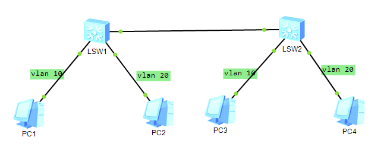

# 11-VLAN Trunk

## Topology



group *PC1* and *PC3* to the same VLAN, and *PC2*, *PC4* to another VALN. So that *PC1* can ping *PC3* but not *PC4*.

## Step

```bash
# create vlans
[Huawei]vlan 10
[Huawei-vlan10]vlan 20
# set the PC4 to vlan 20
[Huawei-vlan20]int g0/0/2
[Huawei-GigabitEthernet0/0/2]port link-type access
[Huawei-GigabitEthernet0/0/2]port default vlan 20
[Huawei]port link-type access
# set the PC3 to vlan 10
[Huawei]int g0/0/1
[Huawei-GigabitEthernet0/0/2]port link-type access
[Huawei-GigabitEthernet0/0/1]port default vlan 10
# set trunk
[Huawei]int g0/0/3
[Huawei-GigabitEthernet0/0/3]port link-type trunk
# allow truck pass vlan
[Huawei-GigabitEthernet0/0/3]port trunk allow-pass vlan all
```

Also, do the same for *LSW1*.

## Result

```bash
The device is running!

<Huawei> User interface con0 is available


Please Press ENTER.

<Huawei>
<Huawei>sy	
<Huawei>system-view 
Enter system view, return user view with Ctrl+Z.
[Huawei]int g0/0/1
[Huawei-GigabitEthernet0/0/1]port lin	
[Huawei-GigabitEthernet0/0/1]port link-t	
[Huawei-GigabitEthernet0/0/1]port link-type acc	
[Huawei-GigabitEthernet0/0/1]port link-type access 
[Huawei-GigabitEthernet0/0/1]port
Apr 30 2023 04:00:32-08:00 Huawei DS/4/DATASYNC_CFGCHANGE:OID 1.3.6.1.4.1.2011.5
.25.191.3.1 configurations have been changed. The current change number is 4, th
e change loop count is 0, and the maximum number of records is 4095.
                                  ^
Error:Incomplete command found at '^' position.
[Huawei-GigabitEthernet0/0/1]port de	
[Huawei-GigabitEthernet0/0/1]quit
[Huawei]vlan 10
[Huawei-vlan10]
Apr 30 2023 04:01:22-08:00 Huawei DS/4/DATASYNC_CFGCHANGE:OID 1.3.6.1.4.1.2011.5
.25.191.3.1 configurations have been changed. The current change number is 5, th
e change loop count is 0, and the maximum number of records is 4095.
[Huawei-vlan10]vlan 20
[Huawei-vlan20]int g	
[Huawei-vlan20]int g
Apr 30 2023 04:01:32-08:00 Huawei DS/4/DATASYNC_CFGCHANGE:OID 1.3.6.1.4.1.2011.5
.25.191.3.1 configurations have been changed. The current change number is 6, th
e change loop count is 0, and the maximum number of records is 4095.
               ^
Error: Unrecognized command found at '^' position.
[Huawei-vlan20]int g0/0/2
[Huawei-GigabitEthernet0/0/2]port acc	
[Huawei-GigabitEthernet0/0/2]port acce	
[Huawei-GigabitEthernet0/0/2]port li	
[Huawei-GigabitEthernet0/0/2]port link-t	
[Huawei-GigabitEthernet0/0/2]port link-type acc	
[Huawei-GigabitEthernet0/0/2]port link-type access 
[Huawei-GigabitEthernet0/0/2]port 
Apr 30 2023 04:02:12-08:00 Huawei DS/4/DATASYNC_CFGCHANGE:OID 1.3.6.1.4.1.2011.5
.25.191.3.1 configurations have been changed. The current change number is 7, th
e change loop count is 0, and the maximum number of records is 4095.
                                  ^
Error:Incomplete command found at '^' position.
[Huawei-GigabitEthernet0/0/2]port d	
[Huawei-GigabitEthernet0/0/2]port de	
[Huawei-GigabitEthernet0/0/2]port default vla	
[Huawei-GigabitEthernet0/0/2]port default vlan 20
[Huawei-GigabitEthernet0/0/2]por	
[Huawei-GigabitEthernet0/0/2]quit
[Huawei]port link-type access
Apr 30 2023 04:02:42-08:00 Huawei DS/4/DATASYNC_CFGCHANGE:OID 1.3.6.1.4.1.2011.5
.25.191.3.1 configurations have been changed. The current change number is 8, th
e change loop count is 0, and the maximum numbeint g0/0/3
[Huawei-GigabitEthernet0/0/3]quit
[Huawei]int g0/0/1
[Huawei-GigabitEthernet0/0/1]port default vlan 10
[Huawei-GigabitEthernet0/0/1]
Apr 30 2023 04:03:32-08:00 Huawei DS/4/DATASYNC_CFGCHANGE:OID 1.3.6.1.4.1.2011.5
.25.191.3.1 configurations have been changed. The current change number is 9, th
e change loop count is 0, and the maximum number of records is 4095.
[Huawei-GigabitEthernet0/0/1]quit
[Huawei]port ty	
[Huawei]int g0/0/3
[Huawei-GigabitEthernet0/0/3]port lin	
[Huawei-GigabitEthernet0/0/3]port link-y	
[Huawei-GigabitEthernet0/0/3]port link-t	
[Huawei-GigabitEthernet0/0/3]port link-type trun	
[Huawei-GigabitEthernet0/0/3]port link-type trunk 
[Huawei-GigabitEthernet0/0/3]
Apr 30 2023 04:04:22-08:00 Huawei DS/4/DATASYNC_CFGCHANGE:OID 1.3.6.1.4.1.2011.5
.25.191.3.1 configurations have been changed. The current change number is 10, t
he change loop count is 0, and the maximum number of records is 4095.
[Huawei-GigabitEthernet0/0/3]port tr	
[Huawei-GigabitEthernet0/0/3]port trunk a	
[Huawei-GigabitEthernet0/0/3]port trunk allow-pass a	
[Huawei-GigabitEthernet0/0/3]port trunk allow-pass vl	
[Huawei-GigabitEthernet0/0/3]port trunk allow-pass vlan al	
[Huawei-GigabitEthernet0/0/3]port trunk allow-pass vlan all 
[Huawei-GigabitEthernet0/0/3]
Apr 30 2023 04:04:52-08:00 Huawei DS/4/DATASYNC_CFGCHANGE:OID 1.3.6.1.4.1.2011.5
.25.191.3.1 configurations have been changed. The current change number is 11, t
he change loop count is 0, and the maximum number of records is 4095.
```

