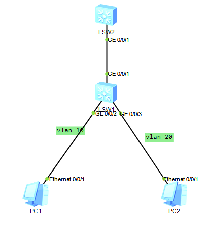

# Triple layers switch



## Usage

allow the top switch to control which flow can access the different VLAN, i.e. PC.

## Steps

Set the gateway for both PCs to different IPs.

Set the VLANs for *PC1* and *PC2*. 

Let *LSW1* be trunk to *LSW2*.

*LSW2* set address for VLANs.

```bash
# setup trunk
[Huawei]int g0/0/1
[Huawei-GigabitEthernet0/0/1]port link-type trunk 
[Huawei-GigabitEthernet0/0/1]port trunk allow-pass vlan all
# build vlan
[Huawei]vlan 10
[Huawei-vlan10]vlan 20
# set the vlan interface's ip for both VLANs
[Huawei]interface Vlanif 10
[Huawei-Vlanif10]ip address 1.1.1.254 255.255.255.0
[Huawei-Vlanif10]int vlanif 20
[Huawei-Vlanif20]ip address 2.2.2.254 255.255.255.0
```

## Result

LSW1

```bash
<Huawei>sy
Enter system view, return user view with Ctrl+Z.
[Huawei]vlan 10
[Huawei-vlan10]v	
[Huawei-vlan10]v
Apr 30 2023 04:23:18-08:00 Huawei DS/4/DATASYNC_CFGCHANGE:OID 1.3.6.1.4.1.2011.5
.25.191.3.1 configurations have been changed. The current change number is 4, th
e change loop count is 0, and the maximum number of records is 4095vlan 20
[Huawei-vlan20]int
Apr 30 2023 04:23:28-08:00 Huawei DS/4/DATASYNC_CFGCHANGE:OID 1.3.6.1.4.1.2011.5
.25.191.3.1 configurations have been changed. The current change number is 5, th
e change loop count is 0, and the maximum number of records is 4095.
               ^
Error: Unrecognized command found at '^' position.
[Huawei-vlan20]int g	
[Huawei-vlan20]int g0/0/2
[Huawei-GigabitEthernet0/0/2]por	
[Huawei-GigabitEthernet0/0/2]port li	
[Huawei-GigabitEthernet0/0/2]port link-t	
[Huawei-GigabitEthernet0/0/2]port link-type a	
[Huawei-GigabitEthernet0/0/2]port link-type access 
[Huawei-GigabitEthernet0/0/2]por	
[Huawei-GigabitEthernet0/0/2]port d	
[Huawei-GigabitEthernet0/0/2]port de	
[Huawei-GigabitEthernet0/0/2]port default vl	
[Huawei-GigabitEthernet0/0/2]port default vlan 
Apr 30 2023 04:25:18-08:00 Huawei DS/4/DATASYNC_CFGCHANGE:OID 1.3.6.1.4.1.2011.5
.25.191.3.1 configurations have been changed. The current change number is 6, th
e change loop count is 0, and the maximum number of records is 4095.	
[Huawei-GigabitEthernet0/0/2]port default vlan 20
[Huawei-GigabitEthernet0/0/2]por	
[Huawei-GigabitEthernet0/0/2]port l	
[Huawei-GigabitEthernet0/0/2]port link-i
Apr 30 2023 04:25:28-08:00 Huawei DS/4/DATASYNC_CFGCHANGE:OID 1.3.6.1.4.1.2011.5
.25.191.3.1 configurations have been changed. The current change number is 7, th
e change loop count is 0, and the maximum number of records is 4095	
[Huawei-GigabitEthernet0/0/2]port link-t	
[Huawei-GigabitEthernet0/0/2]port default vlan 10
[Huawei-GigabitEthernet0/0/2]
Apr 30 2023 04:25:48-08:00 Huawei DS/4/DATASYNC_CFGCHANGE:OID 1.3.6.1.4.1.2011.5
.25.191.3.1 configurations have been changed. The current change number is 8, th
e change loop count is 0, and the maximum number of records is 4095.
[Huawei-GigabitEthernet0/0/2]int g0/0/2
[Huawei-GigabitEthernet0/0/2]int g0/0/3
[Huawei-GigabitEthernet0/0/3]por	
[Huawei-GigabitEthernet0/0/3]port ac	
[Huawei-GigabitEthernet0/0/3]port acc	
[Huawei-GigabitEthernet0/0/3]port acc	
[Huawei-GigabitEthernet0/0/3]port acc	
[Huawei-GigabitEthernet0/0/3]port acce	
[Huawei-GigabitEthernet0/0/3]port lin	
[Huawei-GigabitEthernet0/0/3]port link-t	
[Huawei-GigabitEthernet0/0/3]port link-type a	
[Huawei-GigabitEthernet0/0/3]port link-type access 
[Huawei-GigabitEthernet0/0/3]pr	
[Huawei-GigabitEthernet0/0/3]port de	
[Huawei-GigabitEthernet0/0/3]port default vlan	
[Huawei-GigabitEthernet0/0/3]port default vlan 
Apr 30 2023 04:26:48-08:00 Huawei DS/4/DATASYNC_CFGCHANGE:OID 1.3.6.1.4.1.2011.5
.25.191.3.1 configurations have been changed. The current change number is 9, th
e change loop count is 0, and the maximum number of records is 4095.	
[Huawei-GigabitEthernet0/0/3]port default vlan 20
[Huawei-GigabitEthernet0/0/3]
Apr 30 2023 04:26:58-08:00 Huawei DS/4/DATASYNC_CFGCHANGE:OID 1.3.6.1.4.1.2011.5
.25.191.3.1 configurations have been changed. The current change number is 10, t
he change loop count is 0, and the maximum number of records is 4095.
[Huawei-GigabitEthernet0/0/3]exit
                             ^
Error: Unrecognized command found at '^' position.
[Huawei-GigabitEthernet0/0/3]qui	
[Huawei-GigabitEthernet0/0/3]quit 
[Huawei]int g0/0/1
[Huawei-GigabitEthernet0/0/1]por	
[Huawei-GigabitEthernet0/0/1]port li	
[Huawei-GigabitEthernet0/0/1]port link-t	
[Huawei-GigabitEthernet0/0/1]port link-type vl	
[Huawei-GigabitEthernet0/0/1]port link-type vl	
[Huawei-GigabitEthernet0/0/1]port link-type tr	
[Huawei-GigabitEthernet0/0/1]port link-type trunk 
[Huawei-GigabitEthernet0/0/1]pr	
[Huawei-GigabitEthernet0/0/1]por	
[Huawei-GigabitEthernet0/0/1]port all	
[Huawei-GigabitEthernet0/0/1]port all
Apr 30 2023 04:28:08-08:00 Huawei DS/4/DATASYNC_CFGCHANGE:OID 1.3.6.1.4.1.2011.5
.25.191.3.1 configurations have been changed. The current change number is 11, t
he change loop count is 0, and the maximum number of records is 4095.	
[Huawei-GigabitEthernet0/0/1]port allow	
[Huawei-GigabitEthernet0/0/1]port tr	
[Huawei-GigabitEthernet0/0/1]port trunk al	
[Huawei-GigabitEthernet0/0/1]port trunk allow-pass vl	
[Huawei-GigabitEthernet0/0/1]port trunk allow-pass vlan 	
[Huawei-GigabitEthernet0/0/1]port trunk allow-pass vlan 10	
[Huawei-GigabitEthernet0/0/1]port trunk allow-pass vlan 1	
[Huawei-GigabitEthernet0/0/1]port trunk allow-pass vl	
[Huawei-GigabitEthernet0/0/1]port trunk allow-pass vlan al	
[Huawei-GigabitEthernet0/0/1]port trunk allow-pass vlan all 
[Huawei-GigabitEthernet0/0/1]
Apr 30 2023 04:28:48-08:00 Huawei DS/4/DATASYNC_CFGCHANGE:OID 1.3.6.1.4.1.2011.5
.25.191.3.1 configurations have been changed. The current change number is 12, t
he change loop count is 0, and the maximum number of records is 4095.
[Huawei-GigabitEthernet0/0/1]
```

LSW2

```bash
<Huawei>
<Huawei>
<Huawei>pro	
<Huawei>po	
<Huawei>sy
Enter system view, return user view with Ctrl+Z.
[Huawei]int g0/0/1
[Huawei-GigabitEthernet0/0/1]por	
[Huawei-GigabitEthernet0/0/1]port li	
[Huawei-GigabitEthernet0/0/1]port link-t	
[Huawei-GigabitEthernet0/0/1]port link-type tr	
[Huawei-GigabitEthernet0/0/1]port link-type trunk 
[Huawei-GigabitEthernet0/0/1]
Apr 30 2023 04:29:49-08:00 Huawei DS/4/DATASYNC_CFGCHANGE:OID 1.3.6.1.4.1.2011.5
.25.191.3.1 configurations have been changed. The current change number is 4, th
e change loop count is 0, and the maximum number of records is 4095.
[Huawei-GigabitEthernet0/0/1]por	
[Huawei-GigabitEthernet0/0/1]port all	
[Huawei-GigabitEthernet0/0/1]port tr	
[Huawei-GigabitEthernet0/0/1]port trunk all	
[Huawei-GigabitEthernet0/0/1]port trunk allow-pass v	
[Huawei-GigabitEthernet0/0/1]port trunk allow-pass vlan all
[Huawei-GigabitEthernet0/0/1]
Apr 30 2023 04:30:09-08:00 Huawei DS/4/DATASYNC_CFGCHANGE:OID 1.3.6.1.4.1.2011.5
.25.191.3.1 configurations have been changed. The current change number is 5, th
e change loop count is 0, and the maximum number of records is 4095.
[Huawei-GigabitEthernet0/0/1]int	
[Huawei-GigabitEthernet0/0/1]inter	
[Huawei-GigabitEthernet0/0/1]inter	
[Huawei-GigabitEthernet0/0/1]quit
[Huawei]int	
[Huawei]interface vlan	
[Huawei]interface Vlanif 10
Error: The VLAN does not exist.
[Huawei]vlan 10
[Huawei-vlan10]vlan 20
[Huawei-vlan20]q
Apr 30 2023 04:31:29-08:00 Huawei DS/4/DATASYNC_CFGCHANGE:OID 1.3.6.1.4.1.2011.5
.25.191.3.1 configurations have been changed. The current change number is 7, th
e change loop count is 0, and the maximum number of records is 4095.
[Huawei]int vl	
[Huawei]int	
[Huawei]interface vl	
[Huawei]interface Vlanif 10
[Huawei-Vlanif10]
Apr 30 2023 04:31:50-08:00 Huawei %%01IFNET/4/IF_STATE(l)[52]:Interface Vlanif10
 has turned into UP state.
[Huawei-Vlanif10]ip addr	
[Huawei-Vlanif10]ip address 1.1.1.254
                                      ^
Error:Incomplete command found at '^' position.
[Huawei-Vlanif10]ip address 1.1.1.254 255.255.255.0
[Huawei-Vlanif10]
Apr 30 2023 04:32:20-08:00 Huawei %%01IFNET/4/LINK_STATE(l)[53]:The line protoco
l IP on the interface Vlanif10 has entered the UP state.
[Huawei-Vlanif10]vla
Apr 30 2023 04:32:30-08:00 Huawei DS/4/DATASYNC_CFGCHANGE:OID 1.3.6.1.4.1.2011.5
.25.191.3.1 configurations have been changed. The current change number is 8, th
e change loop count is 0, and the maximum number of records is 4095.	
[Huawei-Vlanif10]vla	
[Huawei-Vlanif10]int vlan	
[Huawei-Vlanif10]int vlanif 20
[Huawei-Vlanif20]
Apr 30 2023 04:32:41-08:00 Huawei %%01IFNET/4/IF_STATE(l)[54]:Interface Vlanif20
 has turned into UP state.
[Huawei-Vlanif20]ip addr	
[Huawei-Vlanif20]ip address 2.2.2.254 255.255.255.0
[Huawei-Vlanif20]
Apr 30 2023 04:33:13-08:00 Huawei %%01IFNET/4/LINK_STATE(l)[55]:The line protoco
l IP on the interface Vlanif20 has entered the UP state.
[Huawei-Vlanif20]
[Huawei-Vlanif20]
Apr 30 2023 04:33:20-08:00 Huawei DS/4/DATASYNC_CFGCHANGE:OID 1.3.6.1.4.1.2011.5
.25.191.3.1 configurations have been changed. The current change number is 9, th
e change loop count is 0, and the maximum number of records is 4095.
```

