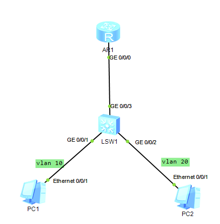

# Single-arm routing

## Topology



*PC1* and *PC2* are in different VLANs and use *AR1* to filter the flow.

## Steps

config the gateway of PCs.

set the VLANs in switch *LSW1*, and routing to AR1.

set the AR1

```bash
# setup two interfaces for VLANs.
interface g0/0/0.10
interface g0/0/0.20
# setup the sub-interface's IEEE 802.1Q VLAN tags
# that is bind the sub-interface to a VLAN
dot1q termination vid 10
# allow arp broadcast
arp broadcast enable
# config the ip address for the sub-interface
ip address 1.1.1.254 255.255.255.0
# do the same for the .20 sub-interface
```

## Result

AR1

```bash
<Huawei>sy
Enter system view, return user view with Ctrl+Z.
[Huawei]interface g0/0/0.10
[Huawei-GigabitEthernet0/0/0.10]interface g0/0/0.20
[Huawei-GigabitEthernet0/0/0.20]interface g0/0/0.10
[Huawei-GigabitEthernet0/0/0.10]dot	
[Huawei-GigabitEthernet0/0/0.10]dot1q 
[Huawei-GigabitEthernet0/0/0.10]dot1q ter	
[Huawei-GigabitEthernet0/0/0.10]dot1q termination ?
  vid  Configure PE VLAN ID
[Huawei-GigabitEthernet0/0/0.10]dot1q termination 	
[Huawei-GigabitEthernet0/0/0.10]dot1q termination vid ?
  INTEGER<1-4094>  Specify low VLAN ID
[Huawei-GigabitEthernet0/0/0.10]dot1q termination vid 10
[Huawei-GigabitEthernet0/0/0.10]arp bo	
[Huawei-GigabitEthernet0/0/0.10]arp boar	
[Huawei-GigabitEthernet0/0/0.10]arp bro	
[Huawei-GigabitEthernet0/0/0.10]arp broadcast en	
[Huawei-GigabitEthernet0/0/0.10]arp broadcast enable 
[Huawei-GigabitEthernet0/0/0.10]ip add	
[Huawei-GigabitEthernet0/0/0.10]ip address 1.1.1.254 255.255.255.0
[Huawei-GigabitEthernet0/0/0.10]
Apr 30 2023 20:07:42-08:00 Huawei %%01IFNET/4/LINK_STATE(l)[0]:The line protocol
 IP on the interface GigabitEthernet0/0/0.10 has entered the UP state. 
[Huawei-GigabitEthernet0/0/0.10]dis this
[V200R003C00]
#
interface GigabitEthernet0/0/0.10
 dot1q termination vid 10
 ip address 1.1.1.254 255.255.255.0 
 arp broadcast enable
#
return
[Huawei-GigabitEthernet0/0/0.10]interface g0/0/0.20
[Huawei-GigabitEthernet0/0/0.20]dot1q termination vid 20
[Huawei-GigabitEthernet0/0/0.20]ip address 2.2.2.254 255.255.255.0
[Huawei-GigabitEthernet0/0/0.20]
Apr 30 2023 20:08:52-08:00 Huawei %%01IFNET/4/LINK_STATE(l)[1]:The line protocol
 IP on the interface GigabitEthernet0/0/0.20 has entered the UP state. 
[Huawei-GigabitEthernet0/0/0.20]arp broadcast enable
[Huawei-GigabitEthernet0/0/0.20]dis this
[V200R003C00]
#
interface GigabitEthernet0/0/0.20
 dot1q termination vid 20
 ip address 2.2.2.254 255.255.255.0 
 arp broadcast enable
#
return
```

LAW1

```bash
[Huawei]interface g0/0/1
[Huawei-GigabitEthernet0/0/1]por	
[Huawei-GigabitEthernet0/0/1]port lint	
[Huawei-GigabitEthernet0/0/1]port lin	
[Huawei-GigabitEthernet0/0/1]port link-t	
[Huawei-GigabitEthernet0/0/1]port link-type ac	
[Huawei-GigabitEthernet0/0/1]port link-type access 
[Huawei-GigabitEthernet0/0/1]
Apr 30 2023 04:53:48-08:00 Huawei DS/4/DATASYNC_CFGCHANGE:OID 1.3.6.1.4.1.2011.5
.25.191.3.1 configurations have been changed. The current change number is 6, th
e change loop count is 0, and the maximum number of records is 4095.
[Huawei-GigabitEthernet0/0/1]interface g0/0/2
[Huawei-GigabitEthernet0/0/2]port link-type access
[Huawei-GigabitEthernet0/0/2]interface g0/0/1
[Huawei-GigabitEthernet0/0/1]port
Apr 30 2023 04:54:08-08:00 Huawei DS/4/DATASYNC_CFGCHANGE:OID 1.3.6.1.4.1.2011.5
.25.191.3.1 configurations have been changed. The current change number is 7, th
e change loop count is 0, and the maximum number of records is 4095.	
[Huawei-GigabitEthernet0/0/1]port d	
[Huawei-GigabitEthernet0/0/1]port de	
[Huawei-GigabitEthernet0/0/1]port default v	
[Huawei-GigabitEthernet0/0/1]port default vlan 10
[Huawei-GigabitEthernet0/0/1]interface g0/0/2
[Huawei-GigabitEthernet0/0/2]port default vlan 10
Apr 30 2023 04:54:28-08:00 Huawei DS/4/DATASYNC_CFGCHANGE:OID 1.3.6.1.4.1.2011.5
.25.191.3.1 configurations have been changed. The current change number is 8, th
e change loop count is 0, and the maximum number of records is 4095.	
[Huawei-GigabitEthernet0/0/2]port default vlan 2	
[Huawei-GigabitEthernet0/0/2]port default vlan 20
[Huawei-GigabitEthernet0/0/2]
Apr 30 2023 04:54:33-08:00 Huawei %%01IFNET/4/IF_STATE(l)[0]:Interface Vlanif1 h
as turned into DOWN state.
Apr 30 2023 04:54:38-08:00 Huawei DS/4/DATASYNC_CFGCHANGE:OID 1.3.6.1.4.1.2011.5
.25.191.3.1 configurations have been changed. The current change number is 9, th
e change loop count is 0, and the maximum number of records is 4095.
[Huawei-GigabitEthernet0/0/2]
Apr 30 2023 04:54:41-08:00 Huawei %%01PHY/1/PHY(l)[1]:    GigabitEthernet0/0/3: 
change status to up
Apr 30 2023 04:54:41-08:00 Huawei %%01IFNET/4/IF_STATE(l)[2]:Interface Vlanif1 h
as turned into UP state.
[Huawei-GigabitEthernet0/0/2]q
[Huawei]int	
[Huawei]interface g	
[Huawei]interface GigabitEthernet0/0/3
[Huawei-GigabitEthernet0/0/3]por	
[Huawei-GigabitEthernet0/0/3]port li	
[Huawei-GigabitEthernet0/0/3]port link-t	
[Huawei-GigabitEthernet0/0/3]port link-type tr	
[Huawei-GigabitEthernet0/0/3]port link-type trunk 
[Huawei-GigabitEthernet0/0/3]por	
[Huawei-GigabitEthernet0/0/3]
Apr 30 2023 05:03:08-08:00 Huawei DS/4/DATASYNC_CFGCHANGE:OID 1.3.6.1.4.1.2011.5
.25.191.3.1 configurations have been changed. The current change number is 10, t
he change loop count is 0, and the maximum number of records is 4095.
[Huawei-GigabitEthernet0/0/3]tr	
[Huawei-GigabitEthernet0/0/3]port tr	
[Huawei-GigabitEthernet0/0/3]port trunk al	
[Huawei-GigabitEthernet0/0/3]port trunk allow-pass V	
[Huawei-GigabitEthernet0/0/3]port trunk allow-pass vlan all
[Huawei-GigabitEthernet0/0/3]
Apr 30 2023 05:03:29-08:00 Huawei DS/4/DATASYNC_CFGCHANGE:OID 1.3.6.1.4.1.2011.5
.25.191.3.1 configurations have been changed. The current change number is 11, t
he change loop count is 0, and the maximum number of records is 4095.
```

