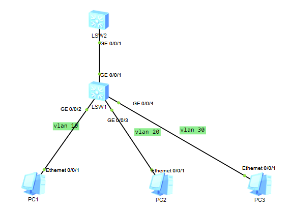

# 15-Access control list (ACL)

## Topology



Deny *PC1* to access *PC3*. But allow all other communicate.

## Steps

Build all connect according to the topology. see [13-Triple layers switch](../13-Triple layers switch/13-Triple layers switch.md).

Setup the rule in *LSW2*

```bash
# create a acl named with "PC3AccessControl" and set it as an advance rule.
# an advance rule means we not only care about src but also care about the des.
acl name PC3AccessControl advance
# add the deny rule
rule deny ip source 1.1.1.0 0.0.0.255 destination 3.3.3.0 0.0.0.255
# allow all others
rule permit ip source any destination any

```

apply the rule on interface of *LSW2*

```bash
# go to the interface
interface g0/0/1
# apply the rule
traffic-filter inbound acl name PC3AccessControl
```

## Note

Not only *PC1* cannot ping *PC3*, but also *PC3* cannot ping *PC1*. It is b/c *PC1* CANNOT reply *PC3*.

## Result

see [result.md](./result.md)