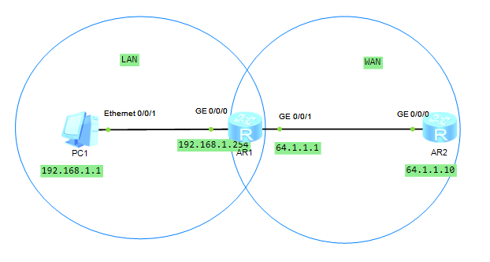

# 16-Network Address Translation(NAT)

## Topology



PC need address translate to access the WAN.

The logic is that

- *PC1* can send package to *AR2*, as the gateway *AR1* know *AR2*.
- However, *AR2* cannot send package back to *PC1*, as the source of received package is `192.168.1.1`. *AR2* cannot send the package to a known address `192.168.1.1`.

If we set the NAT for AR1, then, 

- the src of package is replaced to a WAN IP address, then the *AR2* can reply to that IP
- The *AR1* pass the package to the original IP.

## Step

create the topology and setup accordingly.

config the rule in *AR1* and apply it.

```bash
# add a basic rule for the NAT
# it is necessary, b/c NAT need to specify a acl
acl name LAN basic
# care about the mask, checked bits are set to 0
[Huawei-acl-basic-LAN]rule permit source 192.168.0.0 0.0.255.255

# add a nat group. that means the router can map the LAN to these addresses and then send to WAN
# 64.1.1.2 64.1.1.6 means start and end addresses, all addresses in the range can be uesd.
[Huawei]nat address-group 1 64.1.1.2 64.1.1.6

# goto the interface to WAN to config the NAT
[Huawei]int g0/0/1
# set up the NAT 
# the ACL's id is 2999, i.e. [Huawei-acl-basic-LAN], to get it, use display acl all
[Huawei-GigabitEthernet0/0/1]nat outbound 2999 address-group 1
```

## Common local area network IP

- 192.168.x.x
- 10.x.x.x
- 172.16.x.x - 172.31.x.x

## Result

see [result.md](./result.md)