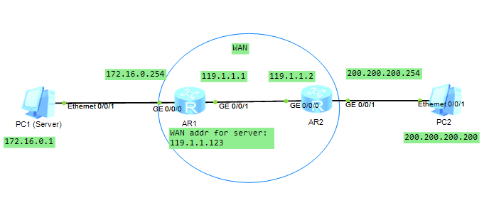

## Topology



The *PC1* is a server which should presents as `119.1.1.123` in the WAN, so that *PC2* can directly access it by this address.

## Usage

Allow publish a server on the WAN.

## Steps

build the topology accordingly.

*AR1* need add static routing *PC2*, b/c it does not know how to find *PC2*'s address.

```bash
[Huawei]ip route-static 200.200.200.0 255.255.255.0 119.1.1.2
```

setup the static NAT in *AR1*

```bash
[Huawei-GigabitEthernet0/0/1]nat server global 119.1.1.123 inside 172.16.0.1
```

## Result

see [result.md](./result.md)